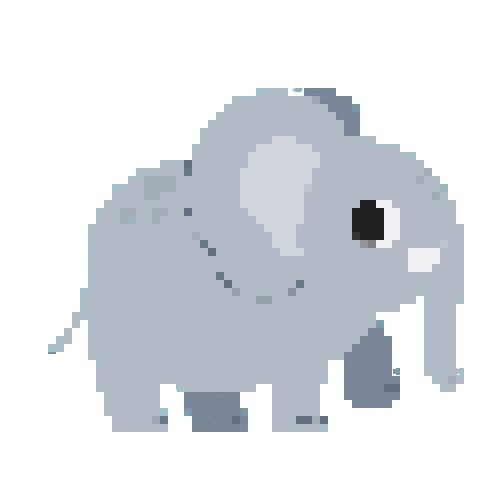
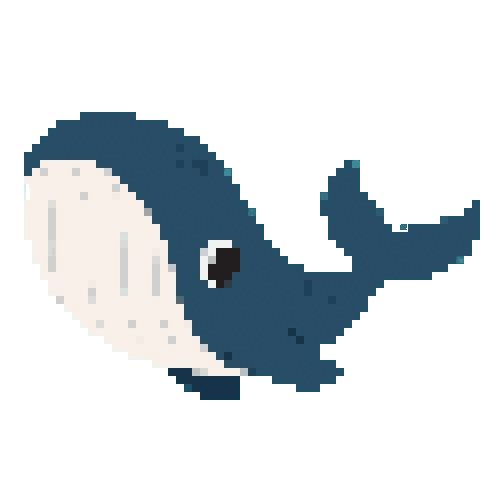
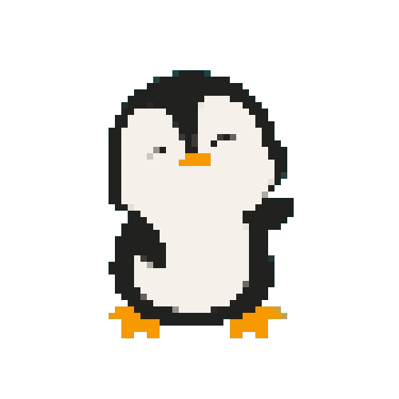

# PrepPal
## Tamagotchi pet that will help you to prepare for your technical interview!

## Content

### Description of the Game
PrepPal is a Tamagotchi pet that will help you to prepare for your technical interview! You will need to feed, play, and study with your PrepPal to make sure it is ready for the big day.

The game proposes 2 languages to study: 
1. Java
2. Python 

For each language there are 2 activities: 
1. interview questions - questions that you could hear during the interview with 4 possible answers to choose from.
2. coding games - a code snippets with a missing code and 4 options what to add on a place of missing code.

There are 3 pets to choose from, each one with its perks:
- **Gradly** - an elephant pet inspired by build tool Gradle. He gains more HP from food, so he is perfect for you, if you want to concentrate on coding games instead of interview questions.
- **Docky** - a whale inspired by Docker. He gains more XP from coding games, so he is a great choice if you want to refresh your knowledge and win the game quicker.
- **Nux** - a penguin inspired by Linux. He gets hungry slower, so he is perfect for longer game experience without a fear of losing.

  
  
  

 

📘Game Design Document is available [here](./PrepPal%20-%20Game%20Design%20Document.pdf)📘
### How to Play

### Technologies Used

### Ways To Improve

### Installation

